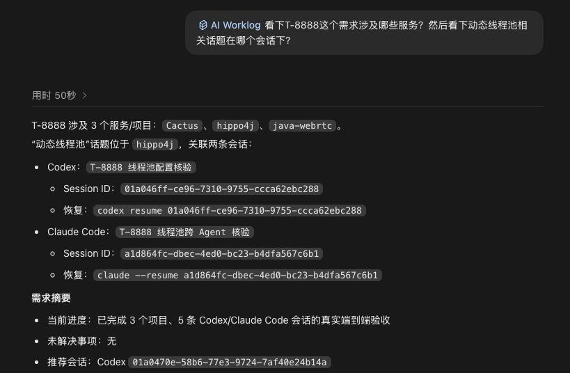

# AI Worklog for Obsidian

[English](README.md) | [简体中文](README.zh-CN.md)

AI Worklog tracks requirements across multiple projects by organizing Codex and
Claude Code multiple sessions into shared, searchable, and resumable work-item
histories in Obsidian.

> Public preview: macOS only. The dossier format is intentionally strict and the
> project has not yet committed to a stable `1.0.0` API.

## Model

One requirement or work item can involve multiple projects and multiple sessions:

```text
Requirement T-123
|-- Projects
|   |-- web-api
|   `-- payment-worker
`-- Sessions
    |-- Codex session in web-api
    |-- Claude Code session in payment-worker
    `-- Codex session in payment-worker
```

Agent is an attribute of each session. Projects and sessions remain flat under
the work item, so recall and query operate across the entire requirement rather
than splitting history by tool.

## Capabilities

- Bind the current Codex or Claude Code session to a requirement, ticket, task,
  or work-order ID.
- Aggregate multiple projects and multiple sessions in one Obsidian dossier.
- Recall every related session newest first, including its Agent and safe resume
  command.
- Query managed work-item histories by project, repository, topic, result,
  status, and other archived fields.
- Preserve manual notes outside managed Markdown regions.

AI Worklog does not bind automatically, search outside its managed archive,
install Obsidian, synchronize vaults, or update both Agent plugins as one
transaction.

## Requirements

- macOS
- Codex CLI/Desktop or Claude Code
- Python 3.10 or later
- Obsidian with at least one local vault
- Git for marketplace installation and upgrades

## Install

Review plugin manifests and the Claude SessionStart command hook before
installation. The hook only exposes Claude's current Agent and Session ID to the
shared Skill; it does not write to Obsidian.

### Codex

```bash
codex plugin marketplace add 4Nz/ai-worklog
codex plugin add ai-worklog@ai-worklog
```

Start a new Codex task after installation.

### Claude Code

```bash
claude plugin marketplace add 4Nz/ai-worklog
claude plugin install ai-worklog@ai-worklog
```

Review and accept the synchronous SessionStart hook, then restart Claude Code.
Without the hook, `bind` fails safely because no trustworthy Claude Session ID
is available.

## Quick Start

Codex:

```text
$ai-worklog bind T-123 Design idempotent payment callbacks
$ai-worklog recall T-123
$ai-worklog query idempotency
```

Claude Code:

```text
/ai-worklog:ai-worklog bind T-123 Design idempotent payment callbacks
/ai-worklog:ai-worklog recall T-123
/ai-worklog:ai-worklog query idempotency
```

Example recall output:



`bind` validates the current Agent, Session ID, repository, project, vault, and
existing dossier before it renames the task. The dossier is written only after
the rename succeeds or you explicitly confirm a manual rename.

## Storage

Shared configuration:

```text
~/.config/ai-worklog/config.yaml
```

Managed dossiers inside the selected vault:

```text
AI-Coding-Archive/WorkItems/<work-item-id>.md
```

Each dossier contains one global summary, a deduplicated project projection,
and a flat newest-first session list. The plugin release version and dossier
`schema_version` are independent. Release `0.1.0` reads and writes only
`schema_version: 1`; ordinary plugin upgrades do not rewrite dossiers.

See [Dossier schema](docs/dossier-schema.md) and
[Architecture](docs/architecture.md) for the managed contract.

## Privacy And Security

Dossiers may contain:

- Agent type and Session ID;
- exact resume commands;
- repository URLs and project names;
- local absolute project paths;
- topics, outcomes, next steps, and status.

Credentials embedded in Git remote URLs are rejected or stripped before
persistence, but the remaining metadata can still be sensitive. Protect the
vault, review its synchronization settings, and do not publish real dossiers in
bug reports. AI Worklog never broadens query into unmanaged vault notes.

## Upgrade

Codex:

```bash
codex plugin marketplace upgrade ai-worklog
```

Start a new task after the command; restart Codex Desktop if it still exposes
the previous version.

Claude Code:

```bash
claude plugin marketplace update ai-worklog
claude plugin update ai-worklog@ai-worklog
```

Restart Claude Code after the update. If both Agents are installed, run both
platform sections. Updating one Agent does not update or roll back the other.

## Rollback

Code can be pinned to a known release tag. Dossier data is not automatically
downgraded.

Codex example for `v0.1.0`:

```bash
codex plugin remove ai-worklog@ai-worklog
codex plugin marketplace remove ai-worklog
codex plugin marketplace add 4Nz/ai-worklog --ref v0.1.0
codex plugin add ai-worklog@ai-worklog
```

Claude Code example for `v0.1.0`:

```bash
claude plugin uninstall ai-worklog@ai-worklog
claude plugin marketplace remove ai-worklog
claude plugin marketplace add https://github.com/4Nz/ai-worklog.git#v0.1.0
claude plugin install ai-worklog@ai-worklog
```

Restart the affected Agent. Review release notes before rolling back across a
dossier schema change.

## Disable And Uninstall

Use `/plugins` in Codex to disable the installed plugin, or remove it:

```bash
codex plugin remove ai-worklog@ai-worklog
```

Claude Code supports both operations:

```bash
claude plugin disable ai-worklog@ai-worklog
claude plugin uninstall ai-worklog@ai-worklog
```

Disable, uninstall, upgrade, and rollback do not delete configuration or
Obsidian dossiers. Delete `~/.config/ai-worklog` or
`AI-Coding-Archive/WorkItems` only as a separate, intentional data cleanup.

## Development

```bash
python3 -m unittest discover -s skills/ai-worklog/tests -v
python3 scripts/validate_release.py
python3 scripts/package_release.py --output-dir dist
claude plugin validate .claude-plugin/plugin.json --strict
```

Runtime code uses only the Python standard library. See
[CONTRIBUTING.md](CONTRIBUTING.md) and the
[release process](docs/release-process.md).

## Limitations And Roadmap

- Linux and Windows are not supported yet.
- Only Codex and Claude Code adapters are built in.
- Cross-machine concurrent vault writes are not serialized.
- Dossier migrations, Obsidian MCP, and public plugin-directory submissions are
  future work.

Licensed under [Apache-2.0](LICENSE).
